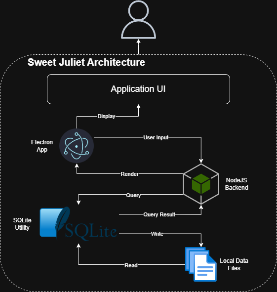
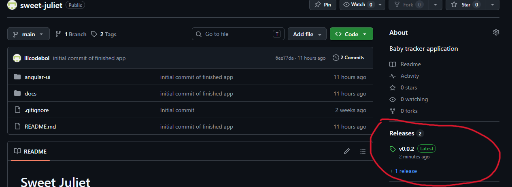
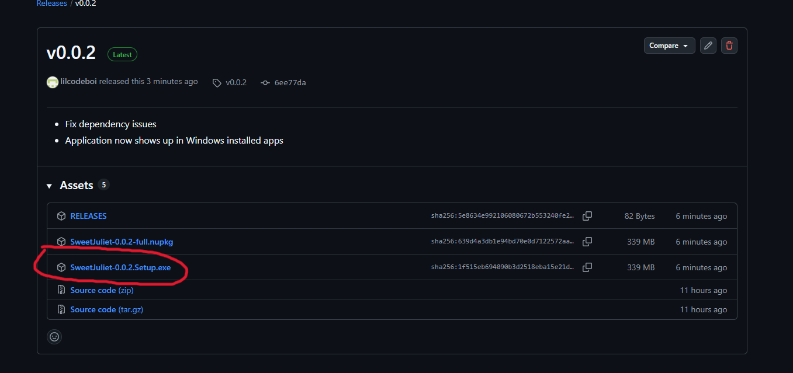

# Sweet Juliet
Sweet Juliet is a desktop application designed for Windows 11 to help parents manage a child's care, growth, and development, significantly reducing the mental load of tracking. It operates entirely offline, providing core functionalities for logging feedings and sleep, tracking appointments, monitoring biometrics, and documenting key milestones.

## Architecture

The Sweet Juliet application is designed to run entirely locally on the user's computer. While future updates may introduce optional cloud features for enhanced flexibility, the current deployment operates independent of external web servers.The platform functions through four interconnected runtime layers:

## Features

- **Feeding Logs**: Track milk intake, formula, and solid foods with timestamps and notes.
- **Sleep Tracking**: Log naps and nighttime sleep with duration and quality ratings.
- **Appointment Management**: Schedule and record medical visits, vaccinations, and check-ups.
- **Biometric Monitoring**: Record weight and height measurements.
- **Milestone Documentation**: Capture developmental milestones with descriptions.
- **Offline-First Design**: All data stored locally; no internet required for core functionality.
- **Cross-Platform Compatibility**: Built with Electron for Windows 11 deployment.

## Installation

1. Download the latest release from the [Releases](https://github.com/lilcodeboi/sweet-juliet/releases) page or click the last release in github repository.

2. Download the installer from the latest release.

3. Run the installer and follow the prompts.
4. Launch the application from the Start menu.

## Developer Notes

- Application has only been tested on Windows 11.
- Application is not yet available for other platforms.
- Currently in development state and not ready for production use.
- May have bugs and unexpected behavior.
